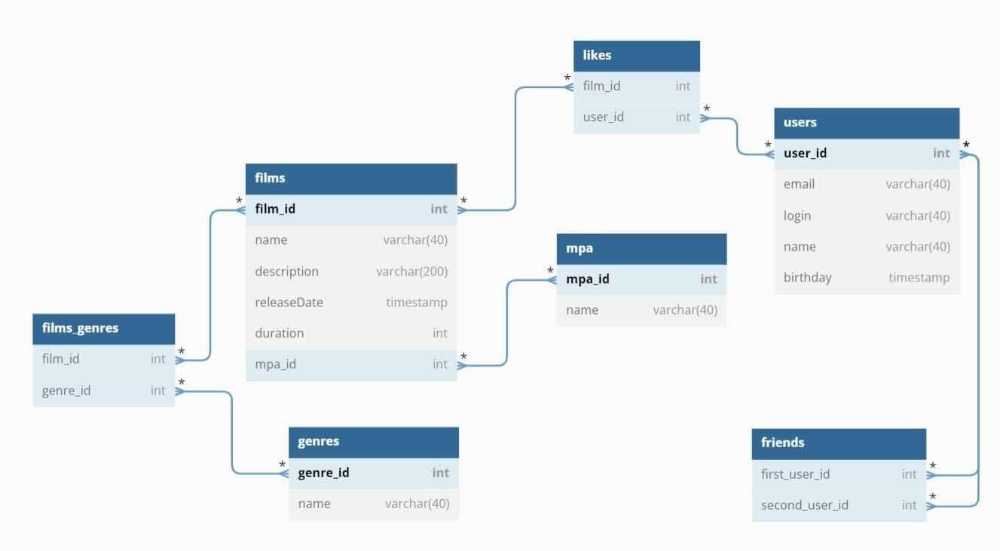

# java-filmorate

Стек: Java, Spring Boot, JDBC, H2, Maven, REST, Swagger, Git.

Filmorate - Аналог Кинопоиска. Позваляет регистрировать пользователей, добавлять в друзья, добавлять фильмы, добавлять информацию о жанрах и возрастных рейтингах, ставить лайки.

Планируется добавить авторизацию с помощью Spring Security, кэширование запросов с помощью Redis.
Развитие проекта в данном репозитории: https://github.com/YurkinED/java-filmorate (командная разработка)

В БД содержится несколько таблиц.
1. Таблица films хранит информацию о фильмах. 
2. Таблица films_genres хранит информацию о том каким жанрам соответствует фильм.
3. Таблица genres содержит информацию о жанрах.
4. Таблица mpa содержит информацию о возрастных рейтингах.
5. Таблица likes содержит информацию о том, какой пользователь какому фильму поставил лайк.
6. Таблица Users содержит информацию о пользователях.
7. Таблица friends содержит информацию о дружбе пользователей.

Примеры запросов в БД.

1) Запрос пользователя по идентификатору:
   SELECT
   login,
   user_name,
   birthday,
   name
   FROM users
   WHERE user_id = (иднтификатор);
2) Аналогично фильм;
3) Запросить фильмы, которые понравились пользователю
   SELECT films.name
   FROM users AS u
   INNER LEFT JOIN likes AS l ON u.user_id = l.user_id
   INNER LEFT JOIN films AS f ON l.film_id = f.film_id
   WHERE user_name = "имя пользователя";
4) Запросить жанр фильма
   SELECT g.genre
   FROM films AS f
   INNER LEFT JOIN films_genres AS g ON g.film_id = f.film_id;
   
   Для тестирования функционала вы можете загрузить zip-файл приложения, открыть в удобной IDE, проверить, что файл с зависимостями успешно загрузил нужные данные, нажать build и запустить класс Application.
